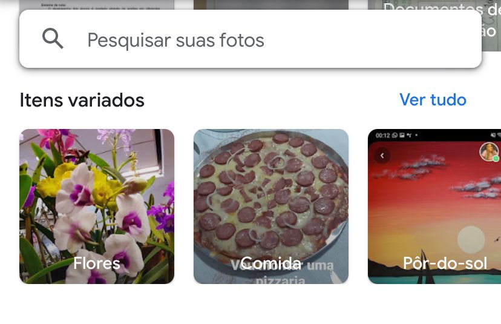

# Relatório sobre Tarefas de Processamento de Imagem

## Introdução

O processamento de imagem desempenha um papel essencial tanto na ciência da computação quanto na engenharia, consistindo na manipulação de imagens digitais para aprimorar sua qualidade, extrair informações relevantes ou executar tarefas específicas. Este relatório explora duas das principais atividades dentro desse campo: Classificação e Segmentação.

Embora ambas as tarefas estejam envolvidas no processamento de imagem, cada uma delas segue uma abordagem distinta. Na classificação, o objetivo é categorizar a imagem em classes pré-definidas. Por exemplo, em um conjunto de imagens contendo gatos e cachorros, o modelo não busca quantificar a quantidade de cachorros em uma imagem, mas sim determinar se ela contém um gato ou um cachorro. Por outro lado, na segmentação, o modelo não apenas identifica objetos pertencentes a uma classe específica, mas também atribui uma classe a cada objeto presente na imagem. Essa técnica é amplamente empregada em áreas como imagens médicas, onde é crucial identificar e classificar cada elemento presente na imagem para diagnósticos precisos.

## Desenvolvimento

### Classificação

A classificação de imagens desempenha um papel fundamental no processamento de imagens, sendo essencial para uma ampla gama de aplicações. Nesse contexto, os modelos de classificação de imagens são treinados para atribuir rótulos ou tags a imagens inteiras, o que permite a categorização e identificação automática do conteúdo das imagens. Ao elaborar um modelo de classificação de imagens, o desenvolvedor enfrenta o desafio de determinar as classes ou categorias relevantes para o domínio específico da aplicação. Por exemplo, em um sistema de reconhecimento de flores, é necessário definir as diferentes espécies de flores que o modelo deve ser capaz de identificar. Além disso, o modelo pode ser treinado para distinguir entre classes diferentes de objetos, como flores e árvores, permitindo uma classificação mais precisa e abrangente do conteúdo das imagens. Assim, a classificação de imagens não apenas facilita a organização e recuperação de grandes conjuntos de dados visuais, mas também desempenha um papel crucial em diversas áreas, incluindo visão computacional, reconhecimento de padrões, diagnóstico médico assistido por computador, entre outros.

#### Produto

Uma ampla gama de produtos e serviços incorpora tecnologias de classificação de imagem para melhorar a experiência do usuário, aumentar a eficiência e oferecer funcionalidades inovadoras. A seguir, destacaremos cinco exemplos notáveis de produtos no mercado que fazem uso dessa tecnologia avançada para oferecer soluções diversas e impactantes:

- Google Photos: O Google Photos utiliza algoritmos avançados de classificação de imagem para organizar automaticamente fotos com base em diferentes categorias, como pessoas, lugares, objetos e eventos.

- Adobe Sensei: A plataforma Adobe Sensei incorpora recursos avançados de inteligência artificial, incluindo classificação de imagem, para ajudar os usuários a organizar e gerenciar suas bibliotecas de mídia, como o Adobe Lightroom e o Adobe Stock.
  
- Pinterest: O Pinterest utiliza algoritmos de classificação de imagem para fornecer recomendações personalizadas de conteúdo com base nas preferências e interesses dos usuários, analisando o conteúdo das imagens que eles salvam ou interagem na plataforma.

- Clarifai: A Clarifai oferece uma plataforma de inteligência artificial que inclui recursos de classificação de imagem. Sua API permite que desenvolvedores incorporem facilmente recursos de visão computacional em seus aplicativos e serviços para reconhecimento de objetos, detecção de conceitos e classificação de imagens.

#### Teste Classificação

Para a elaboração deste relatório, utilizei a ferramenta Google Photos para compreender o potencial da visão computacional e a tarefa de classificação de imagens. Essa ferramenta é altamente útil para a organização de fotos. Um exemplo prático é o seu uso por influenciadores digitais no Instagram. Muitas vezes, é necessário participar das tendências nos stories, pois isso proporciona maior visibilidade para um determinado conteúdo. Através do Google Photos, uma imagem pode ser facilmente localizada.

Na figura acima, observa-se que o Google Photos classifica as imagens. Assim, se a imagem for de uma flor, ela será categorizada como tal, enquanto a de pizza será colocada em outra categoria. Isso facilita a organização e o acesso às fotos. Por exemplo, a imagem da flor foi capturada em 2022, enquanto a da pizza em 2020. Seria muito trabalhoso percorrer aproximadamente 1000 imagens para encontrá-las, evidenciando o potencial da classificação.

### Segmentação

A segmentação de imagens é uma técnica avançada no processamento de imagens, onde o objetivo é dividir uma imagem em regiões ou objetos de interesse. Diferentemente da classificação, que atribui um rótulo a toda a imagem, a segmentação atribui um rótulo a cada pixel na imagem, indicando a que objeto ou região ele pertence. Essa técnica é amplamente utilizada em áreas como visão computacional, medicina e monitoramento ambiental.

#### Produto

A segmentação de imagem é uma técnica essencial em diversas aplicações, permitindo a identificação e separação de regiões de interesse em uma imagem. Aqui estão cinco produtos no mercado que fazem uso da segmentação de imagem:

- Adobe Photoshop: O software Adobe Photoshop oferece uma ampla gama de ferramentas avançadas de segmentação de imagem, permitindo que os usuários isolem e editem áreas específicas de uma imagem de forma precisa e eficiente.

- Tesla Autopilot: Os veículos Tesla equipados com o sistema Autopilot utilizam a segmentação de imagem para identificar e segmentar diferentes elementos do ambiente ao redor do carro, como pedestres, veículos, sinais de trânsito e obstáculos, contribuindo para a condução autônoma.

- Facebook: A plataforma Facebook utiliza a segmentação de imagem em seu algoritmo de reconhecimento facial para identificar e segmentar rostos em fotos carregadas pelos usuários, oferecendo recursos de marcação e organização automática de fotos.

- Google Maps: O Google Maps faz uso da segmentação de imagem para identificar e destacar áreas de interesse, como estradas, edifícios, parques e corpos d'água, proporcionando uma experiência de mapeamento mais informativa e detalhada.

#### Teste Segmentação

A segmentação pode ser aplicada em diversos contextos e indústrias, como demonstrado anteriormente. Enquanto no Photoshop é possível utilizar essa ferramenta explicitamente, a segmentação no Google Maps ocorre de forma interna, sem que o usuário tenha conhecimento. Para testar o produto, utilizamos o Photoshop. Com essa ferramenta, podemos realizar montagens selecionando partes importantes da imagem e inserindo-as em outros contextos.

Na imagem sem segmentação abaixo:

E na imagem segmentada a seguir:

É perceptível que na primeira imagem não há separação entre o fundo e o elemento principal, que é a mão. Na segunda imagem, porém, é possível editar o elemento mão separadamente do fundo. A parte segmentada é destacada em vermelho, permitindo não apenas a edição do elemento principal, mas também a alteração do plano de fundo. Assim, é possível identificar dois segmentos diferentes em uma única foto: o elemento e o fundo.

## Conclusão

As tarefas de processamento de imagem desempenham um papel crucial em uma variedade de campos, desde medicina e segurança até design gráfico e robótica. Os produtos comerciais disponíveis oferecem uma ampla gama de ferramentas e recursos para atender às necessidades de diferentes segmentos de mercado, demonstrando a importância contínua do processamento de imagem na era digital. Além disso, é relevante observar que uma mesma aplicação, como armazenamento de fotos, pode realizar uma variedade de tarefas. Por exemplo, o Google Photos não só classifica imagens, mas também identifica objetos. Em uma foto com várias pessoas, ele consegue identificar cada indivíduo presente, permitindo que o usuário organize e categorize a imagem de acordo.
