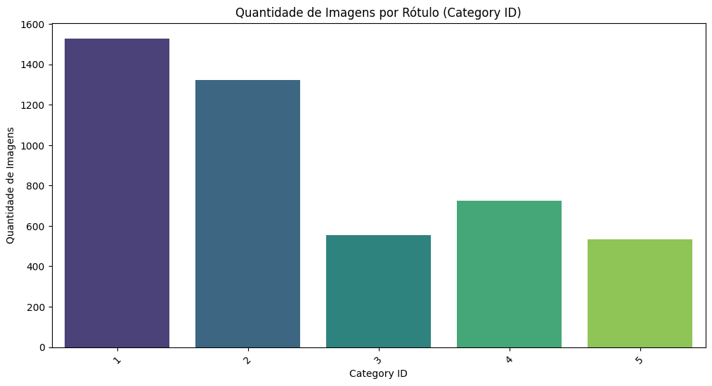
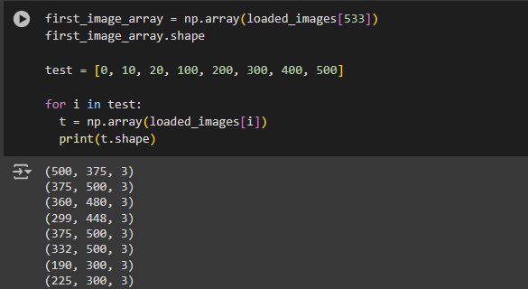
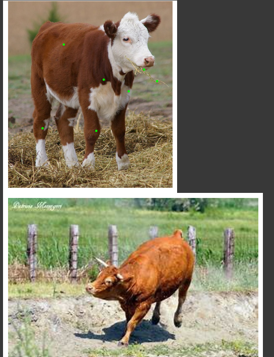

# Relatório

# Animal pose estimation

Um pose estimation dataset é um conjunto de dados utilizado para treinar e avaliar modelos de detecção e estimativa de pose humana em imagens e vídeos. Esses datasets geralmente contêm anotações detalhadas das posições das articulações do corpo humano (como ombros, cotovelos, pulsos, quadris, joelhos e tornozelos) em múltiplas imagens. As anotações podem ser fornecidas na forma de coordenadas 2D ou 3D, dependendo do tipo de dados e do objetivo da aplicação.

Os principais componentes de um pose estimation dataset incluem:

- Imagens/Vídeos: Fotografias ou sequências de vídeo que contêm pessoas em várias posturas.
- Anotações de Articulações: Coordenadas dos pontos-chave das articulações do corpo humano.
- Meta-informações: Dados adicionais como a categoria da atividade, informações demográficas dos participantes, condições ambientais, entre outros.

# Dataset utilizado

O dataset Cross-domain Adaptation for Animal Pose Estimation foi desenvolvido por Jinkun Cao, Hongyang Tang, Hao-Shu Fang, Xiaoyong Shen, Cewu Lu e Yu-Wing Tai. Este conjunto de dados é projetado para abordar o problema da estimativa de pose em animais, que é um desafio significativamente mais complexo comparado à estimativa de pose humana devido à grande variabilidade nas formas e tamanhos dos corpos dos animais, assim como suas posturas diversificadas.

Possuindo dois arquivos: Um zip com todas as imagens e um json com os keypoints

# Exploração Geral

O conjunto possui 4608 imagens de animais, tendo 5 labels disponibilizadas para diferentes tipos de animais sendo eles: Cachorro (1), gato(2), ovelha(3), cavalo(4) e bovino(5).

Na análise exploratória inicial percebe-se que os dados não estão muito bem distribuindo sendo mais de 50% classificados como cachorro e gato.

# Filtros bovinos

Após essa visualização geral foi filtrados apenas os bovinos para explorar melhor a base de dados, sendo encontrado as seguintes características:

* O conjunto de dados bovino possui 534 imagens.

* O tamanho das imagens são variados

Para os tamanhos variados foi aplicado uma normalização deixando todas elas 100x100:

Além disso os keypoints não foram aplicado em todas as imagens bovinas.

# Conclusão

## Aprendizados principais

Ao longo deste estudo sobre o dataset "Cross-domain Adaptation for Animal Pose Estimation", foi possível compreender a complexidade envolvida na tarefa de estimativa de pose em animais. Diferente dos datasets tradicionais voltados para humanos, este conjunto de dados se destaca pela diversidade de espécies e pela variabilidade nas posturas dos animais. As principais lições aprendidas incluem:

- Diversidade e Variabilidade: A variedade de espécies e posturas capturadas no dataset sublinha a necessidade de técnicas robustas de modelagem que possam generalizar bem para diferentes tipos de animais.

- Adaptação de Domínio: A adaptação de modelos de pose humana para animais é um campo promissor, mas desafiador, que requer inovação contínua em técnicas de transferência de conhecimento e adaptação de domínio.

- Distribuição de Dados: A análise revelou uma distribuição desigual entre as classes de animais, com predominância de cães e gatos, o que pode influenciar negativamente o desempenho dos modelos em classes menos representadas, como bovinos.

## Limitações:

- Desigualdade na Distribuição das Classes: A predominância de imagens de cães e gatos pode levar a um viés nos modelos treinados, reduzindo sua eficácia em prever poses para outras espécies.

- Qualidade e Consistência das Anotações: A falta de keypoints anotados em todas as imagens, especialmente nas classes minoritárias como bovinos, limita a quantidade de dados utilizáveis para treinamento e validação.

- Tamanhos Variados de Imagens: A variação nos tamanhos das imagens introduz complexidades adicionais no pré-processamento e normalização dos dados, o que pode impactar a performance dos modelos.

## Trabalhos futuros: 

- Aumento da Diversidade de Dados: Coletar mais dados para as classes sub-representadas e garantir uma distribuição mais equilibrada pode ajudar a melhorar a generalização dos modelos.

- Melhoria na Anotação dos Keypoints: Garantir que todas as imagens tenham keypoints corretamente anotados aumentaria a eficácia do treinamento e a precisão das previsões.

- Desenvolvimento de Técnicas de Normalização Automatizadas: Criar métodos automatizados e eficientes para a normalização das imagens poderia simplificar o pré-processamento e melhorar a consistência dos dados.

- Exploração de Modelos Multi-domínios: Investigar e desenvolver modelos que possam aprender simultaneamente com dados humanos e animais, utilizando técnicas avançadas de transferência de aprendizado e adaptação de domínio, poderia levar a avanços significativos na estimativa de pose animal.

- Análise de Robustez: Realizar estudos adicionais sobre a robustez dos modelos em diferentes condições ambientais e contextos de uso prático pode fornecer insights valiosos para aplicações no mundo real.
